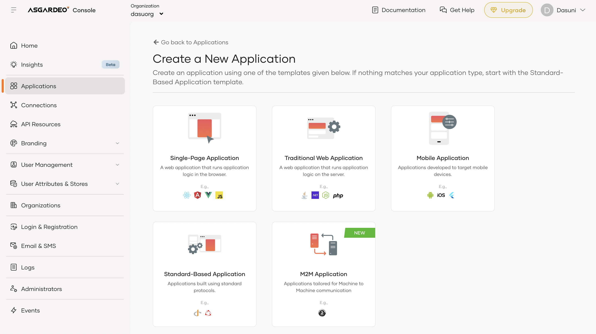
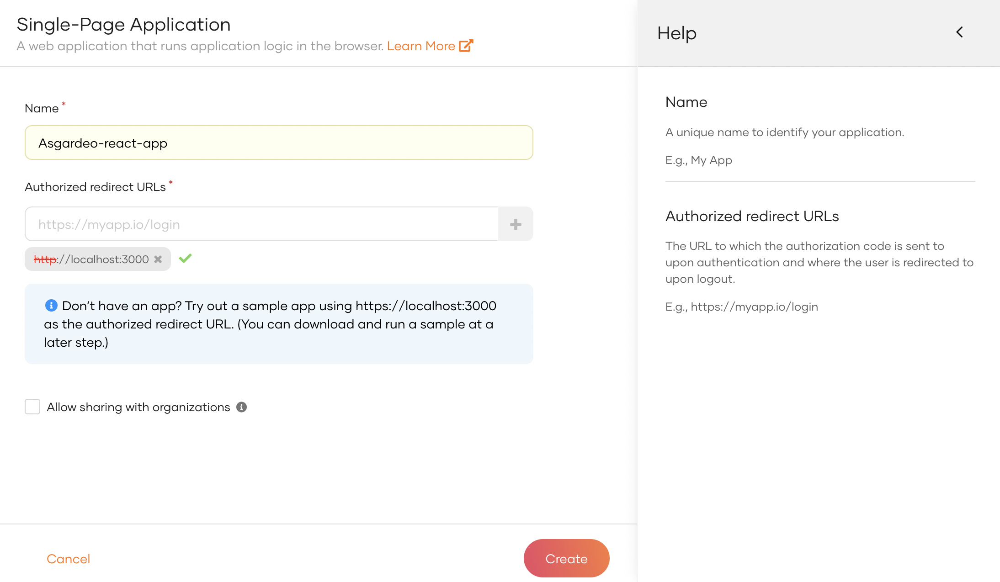
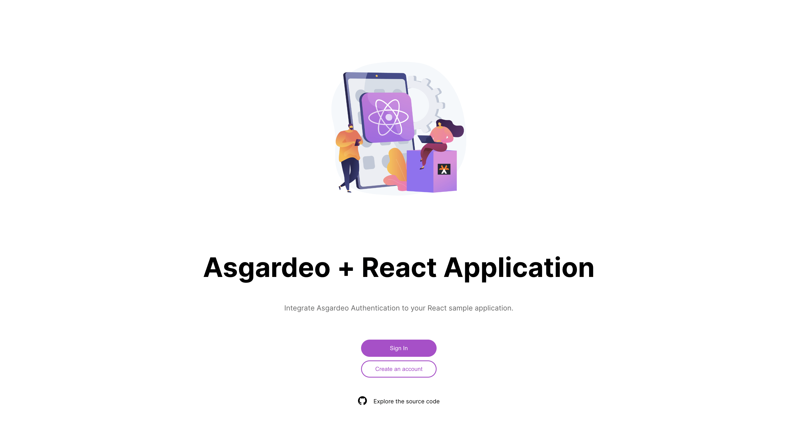

## 👀 Live Deployment

A live preview of this demo is available at
1. Vercel: []()

## Features/ Capabilities

- Sign up to Asgardeo as a new user 
- Sign In and Sign Out of the application
- Home page with welcome text and logged in username
- Sign Out capability

## Configure Asgardeo to integrate with your application

Create the application

1. Access Asgardeo at https://console.asgardeo.io/ and log in.

2. Click Applications in the left navigation menu.

3. Create a new application
- Select Single Page Application



4. Fill the details and click Create.
- Name: Asgardeo-react-app
- Authorized Redirect URLs: http://localhost:3000




## 🚀 Getting Started

1. Clone the repository.

```bash
git clone https://github.com/dasuni-30/asgardeo-react-app-theme.git
```

2. Install the dependencies.

```bash
npm install
```

3. Create a `.env` file based on the `.env.example` file.

```bash
cp .env.example .env
```

4. Update the values in the `.env` file based on your requirements.

```bash
# The client ID for the Asgardeo Single Page Application (SPA) app
REACT_APP_CLIENT_ID=fDLlYMi674hxxCwuH0809KstlRsa

# The base URL for the Asgardeo organization's API
# E.g., https://api.asgardeo.io/t/your-org
REACT_APP_ASGARDEO_BASE_URL=https://api.asgardeo.io/t/dasuorg

# The sign-up URL for the Asgardeo organization
REACT_APP_SIGN_UP_URL=https://accounts.asgardeo.io/t/dasuorg/accountrecoveryendpoint/register.do?client_id=

# The application name for the Asgardeo application
REACT_APP_APPLICATION_NAME=Asgardeo-react-app

# The organization name for the Asgardeo
REACT_APP_ORG_NAME=dasuorg

# The base URL for the client application
# E.g., http://localhost:3000
REACT_APP_BASE_URL="http://localhost:3000"

```

5. Start the development server.

```bash
npm start
```

This will start the app on [http://localhost:3000](http://localhost:3000).


